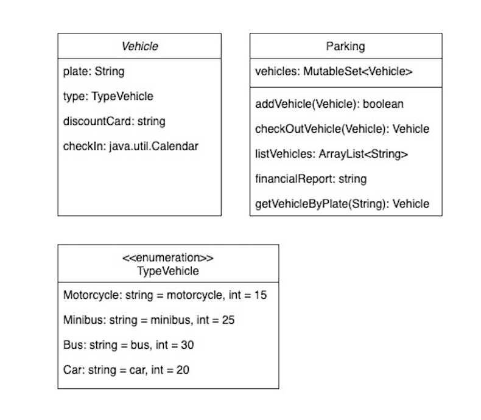

## AlkeParking
AlkeParking is a parking lot that allows four types of vehicles (car, motorcycle, minibus and bus)
and has a maximum capacity of up to 20 parked vehicles.

## Project Structure

#### packages

- parking - classes of domain Parking. All classes related to domain Parking
- prompt - classes that implement interaction with terminal.
- util - utility classes and enum classes.
- vehicle - classes of domain Vehicle. All classes related to domain Vehicles.

#### Classe

`parking.Parking`

_public data class_

The _Parking_ class contains all methods and properties that allow to instantiate a parking and its functionalities.

#### properties

`public var vehicles: MutableSet<Vehicle>`

Variable stores a list of vehicles. Must initialize on constructor of class `Parking(vehicles : MutableSet<Vehicle>)`

`private var report: Pair(Int, Int)`

That variable is initialized with values integer numbers. it is used to store data from financial report.

##### methods

`addVehicle(vehicle: Vehicle): Boolean`

That method allows to add a vehicle to the parking lot. The input parameter is a variable type of `Vehicle`. If the operation was a success its return is a boolean type, in that case, it returns true.

`checkOutVehicle(vehicle: Vehicle): Vehicle?`

That method checkout a vehicle from the parking lot (Can indicate the vehicle in the input parameter). When this method is called, other methods are also called. That is necessary because a series of operations are also carried, such as remove a vehicle, calculating fee and discount, verifying if the vehicle exists. The method returns a vehicle type value if the operations were successful, otherwise it returns null.

`listVehicles(): ArrayList`

That method get a list of vehicles, but it returns only the license plate in string type.

`financialReport(): String`

That method returns the financial report. The financial report shows the total number of vehicles removed from the parking lot and the total earnings.

`vehicleAlreadyParked(vehicle: Vehicle): Boolean` _private method_

Allows to check if the vehicle is in the parking lot.

`getVehicleByPlate(plate: String): Vehicle?`

Get a vehicle by license plate, if the vehicle was found the method will return true.

#### Classe 

`vehicle.Vehicle`

#### properties

The `data class Vehicle()` will represent a vehicle and contains the following attributes:

`plate: String,`
`type: TypeVehicle,`
`discountCard: String? = null,`
`checkIn: Calendar = getInstance()`

#### methods

`val parkedTime: Long()`

receives the vehicle's check-in and check-out time in milliseconds and returns, in minutes, the calculation of how long the vehicle was parked

#### Classe

The `enum class TypeVehicle(val type: String, val tax: Int)` contains the constant values of the four types of vehicles and their specific fixed fees.

## Usage

First of all you must instantiate the `Parking` class and pass an empty list type `MutableSet<Vehicle>` through its constructor. Look at the example:

1 `1 val vehicles = MutableSet<Vehicle>`

2 `val parking = Parking(vehicles)`

Now, you have an empty Parking lot,  and you can add vehicles. But for that you must instantiate `Vahicle` class like that:

3 `val vehicle = Vehicle("GOTS12", TypeVehicle.CAR, "DISC12)`

The three arguments passed in the constructor of `Vehicle`class are: a string that represents a license plate of vehicle, the type of vehicles from `TypeVehicle`class and a discount car.

Now you can call the method `addVehicle()` from the `Parking` class and pass the variable `vehicle` through the constructor:

4 `parking.addVehicle(vehicle)`

You have the first vehicle in the parking lot and can add others. In the class `Parameters` you can define the limit maximum of vehicles allowed.

The method `checkOutVehicle()`allows you checkout a vehicle from the parking lot. You must pass a variable of type `Vehicle` as a parameter:

5 `parking.checkOutVehicle(vehicle)`

That method will return a value boolean, it means that value was true the operation was successful.

You can obtain the operations report of the parking calling the method `financialReport()`:

6 `parking.financialReport()`

## Features
- Add vehicle to the parking lot by entering the license plate number from an Options Menu on the console;
- Inform discount coupon, if any, to reduce the total fare by 15%;
- Remove vehicle from the parking lot and inform the total amount of the fee to be paid;
- List the list of license plates of vehicles that are parked at the moment;
- List the total number of vehicles that were removed from the parking lot;
- List the values received from all vehicles that have been parked.

#### Fees

Each type of vehicle has a specific fixed rate, as shown in the table below:

| Type of vehicles   | Fee |
| ------------------ |----:|
| Car                | $20 |
| Motorcycle         | $15 |
| Minibus            | $25 |
| Bus                | $30 |

After the first 2 hours, there will be a variable rate where you will be charged $5 for every 15 minutes exceeded, regardless of the type of vehicle.

## Developed
- Lenilson Santiago (lenilson.santiago@mercadolivre.com)
- Emanuelle Carvalho (emanuelle.carvalho@mercadolivre.com)

Project developed as the first Integrating Exercise of Mercado Livre's IT Bootcamp Mobile Android

